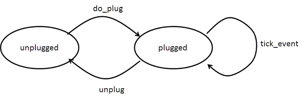

# StateMachine
This state machine is a compact table-driven state machine on Python. In general, a state machine contains a set of states, a set of possible input events and the actions should be performed when an event is recevied on a specified state. A state is changed to another state by performing specified actions when a specified event is received. State diagram or state table is used to describe state transitions, and the later is more formally, and easier to be implemented correspondingly. Although simply state machine can be implemented by nested switch/case or if/else, considering the requirement of re-usability or maintainable, table-driven state machine pattern is recommended to use for more complex cases.

Where we should use state machine:

* simple parser, lexers, ... or any filter-pattern stuffs
* UI logic, which represents enable, disable, checked, unchecked and so on.
* device control, typical sample is like the control of recorder, player, or something like that

When you find you have to do with a group of complex rule and conditions, you should consider to use state machine pattern. A simple example is like:

* A device has 2 states, plugged, unplugged
* This device driver received 'tick_event' for each 1 second
* An event 'do_plug' to change state from 'unplugged' to 'plugged'
* An event 'unplug' to change state from 'plugged' to 'unplugged'
* On plugged state, when it received 'tick_event', it read data from device
* On unplugged state, when it received 'tick_event', it do nothing

We describe this rule by state diagram:
 

Also, we may discribe this state transitions by a table:

|  	| unplugged 	| plugged 	|
|------------	|--------------------------	|----------------------------	|
| do_plug 	| transit to plugged state 	| no op 	|
| unplug 	| no op 	| transit to unplugged state 	|
| tick_event 	| no op 	| read data 	|

x-axis represents a set of possible states: plugged, unplugged
y-axis represents a set of possible events: tick_event, do_plug, unplug

The each cell represents the action that should be performed when received the event under the state.

When you have to handle a complex rule, such as an action should only be performed under a set of specified states, or a group of specific events should be handled differentially for different states, it is better to use a table to describe them and use a table-driven state machine to implement them. For example, using simple state machine, you simply implement above example:
```
from simple_sm import state_machine as sm
class DeviceCore:
	def handle_tick_event(self, *args, **kwargs):
		'plugged -- tick_event --> plugged'
   		self.read_data()

	def do_plug(self, *args, **kwargs):
		'unplugged -- do_plug --> plugged'

	def unplug(self, *args, **kwargs):
		'plugged --> unplug --> unplugged'

device = sm.StateMachine('Device', DeviceCore(), start='unplugged', debug=True)

device.tick_event()
device.do_plug()
device.tick_event()
device.unplug()
```

The log looks like:
```
asfsf
```

# How to use
## Define state table
You define state table by 2 methods:
1) by __doc__ of functions
Please check the following example:
```
	def unplug(self, *args, **kwargs):
		'plugged --> unplug --> unplugged'

```
In the example, the function name unplug() do not matter, you may name this function to any name. And the __doc__ of this function defines a transition, which the first segment: `plugged` is start state, the third segment `unplugged` represents the end state, it means this transition will transit from `plugged` state to `unplugged` state. The middle segment `unplug` represents the event that causes this transition.

You have to define all transitions for a state diagram. Thus, you provide enough information for state machine, such as a group of states, a group of events and the bound actions.

2) by add_transit() function.
You also can write the code like the following to define a transition:
```
	sm.add_transit(start, event, end, func)
```

## Define event handler by wildcard
You may define multiple events by wildcard, which share same event handler, like:
```
    def _other_event_market(self, event):
        'started ---> k_event_* -> started'
        pass
```

Thus, any event like `k_event_tick`, `k_event_bars`, will be handled by this function.

only the following wildcard characters are supported:
```
*  multiple characters
?  single characters
```

## Pass in event
You have 2 methods to pass in event to state machine object:
1) call the method with same name as event
For example,
```
	def nothing_unplug(self, *args, **kwargs):
		'plugged --> unplug --> unplugged'
```
when you defines this transition, the state machine will create a method named `unplug`, thus, you
may send event to this state machine by calling this function directly, like:
```
	device.unplug()
```

2) Due to the wildcard event definition, you have to call the function `handle_event` to pass in event:
```
	device.handle_event('k_event_tick')
```

###Change default end state
You may change default end state when you handle an event. Normally, you need not to care about it. So the destinate state will be as you set in your transition table. But sometimes, you need to change the destinate state according to your logic:
```
	def nothing_unplug(self, *args, **kwargs):
		'plugged --> unplug --> unplugged'
		if something_error:
			return False #This code will refuse to change state to unplugged.
```
In this state machine, `no return`, `return True` default change state to end state as you setting, while `return False` will refuse do such transition.

If you want to state machine transit to a specified state, of course, it is not recommended, you may do like that:
```
	def nothing_unplug(self, *args, **kwargs):
		'plugged --> unplug --> unplugged'
		if some_condition_satisifed:
			self.next_state = `specified_state`
```
# Bug reports

Hope this small piece of code does your help, if it can make your code more simple, more maintainability, I shall feel happy. If you find any problems, or you have any improvement advice, please contact with me by the following e-mail address:
-- By woody(li.woodyli@gmail.com)


